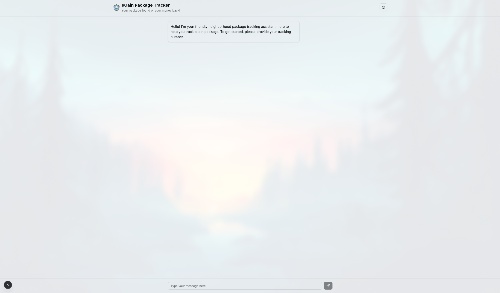
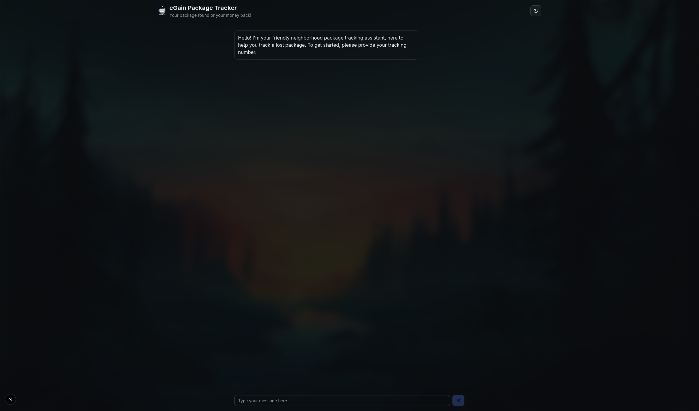
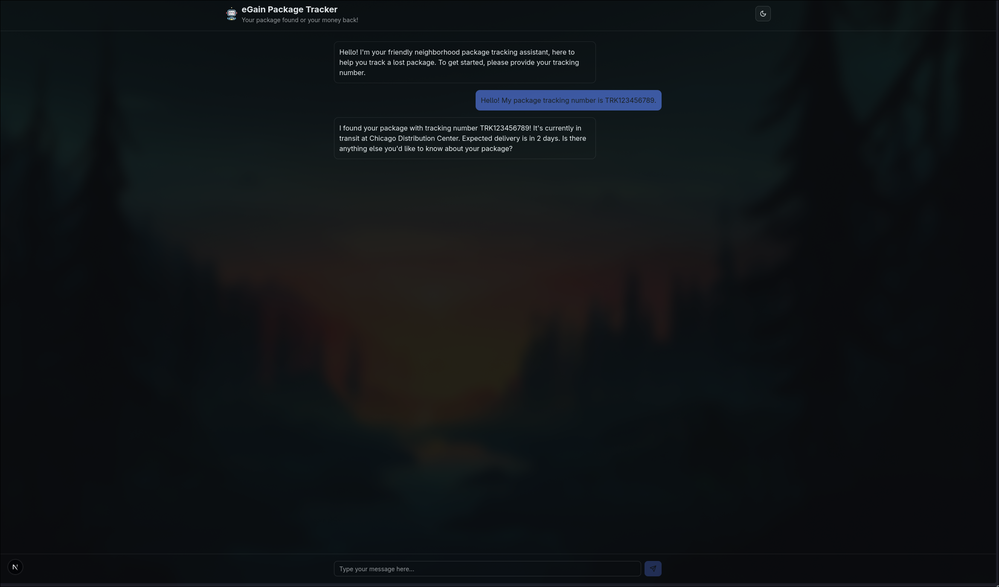
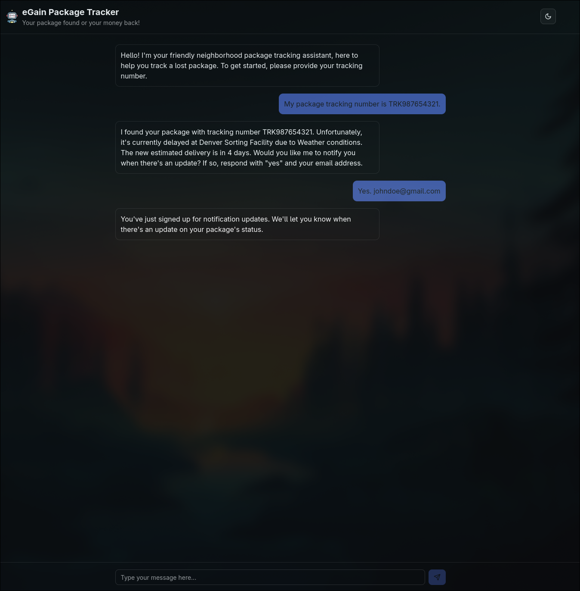
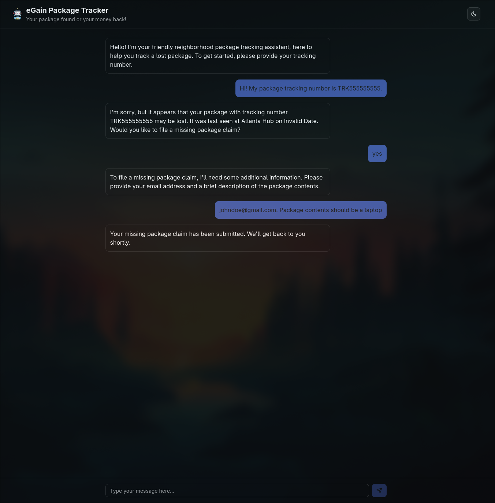
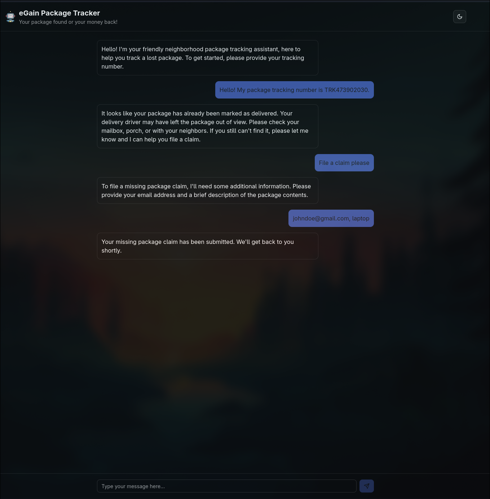
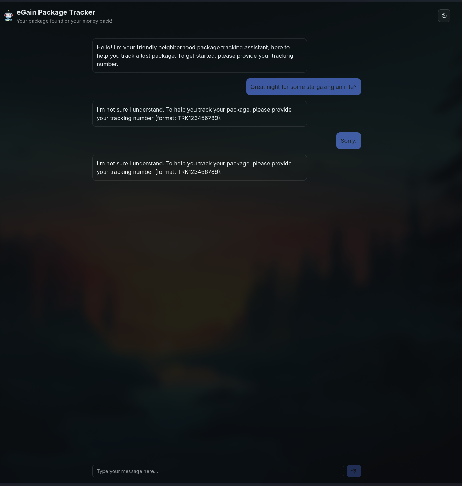
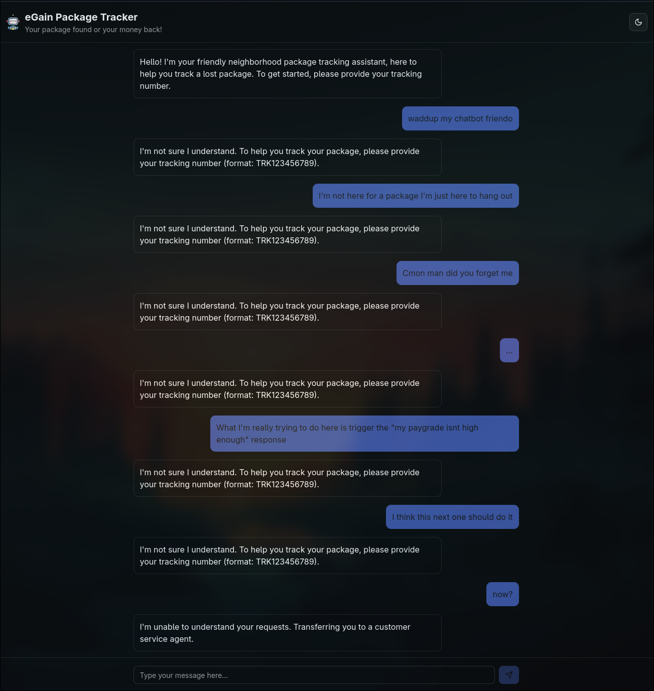

# eGain Internship Takehome Assignment

Package Tracking Chatbot

## Running Locally
Below are instructions on running the chatbot locally. Due to the nature of the assignment, all data is hardcoded locally in an object passed into the page.

### Prerequisites

* Latest NodeJS (LTS/Current)
    - NodeJS Download/Install Instructions: https://nodejs.org/en/download

### Quickstart

1. Clone the repo and cd to the directory
```sh
# Clone with HTTPS
$ git clone https://github.com/WangRyan408/eGain-Takehome
# or clone with SSH
$ git clone git@github.com:WangRyan408/eGain-Takehome.git
# OR use the Github Desktop GUI to clone with the HTTP URL
https://github.com/WangRyan408/eGain-Takehome
# THEN change directory to the project folder
# I split the commands up so it should work on windows too
$ cd eGain-Takehome
$ cd chatbot
```

2. Install NPM dependencies
```sh
$ npm install
```

3. Run the development server 
```sh
$ npm run dev
```

4. Open the site on your browser on http://localhost:3000


### Usage

This chatbot has some tracking numbers hardcoded in for testing purposes. They're listed below for your convenience.
- TRK123456789 (in transit)
- TRK987654321 (delayed)
- TRK555555555 (lost)
- TRK473902030 (delivered)

Play around with each one!

## Approach to Design and Structure

- Design
   - When it comes to design, I've recently been into scaffolding projects with NextJS. NextJS comes with the TailWindCSS library and Shadcn/UI component library &mdash; which I think looks amazing. The instructions for this assignment were to just spend a short period of time to build a simple UI (either in browser or tty), but I wanted to go a step further and make this pleasing to the eye. After all, such a tool would surely be intended for users/consumers. 
- Technicals
    - I chose the first scenario of helping customers track lost packages, and I started off with asking myself what sort of situations could a package potentially find itself in. After thinking about it, I landed on five distinct states: in transit, delayed, lost, delivered, or unknown. I set up switch statements based on the package's known state in the database, and if for some reason the tracking number returned a status that wasn't the previous four, it would prompt the user to seek a human agent to help. Lastly, there is a fallback for if no other conditional catches what a customer may potentially want. It reiterates what the user should type in to receive proper support. 
- Future Additions
    - I've added functions for passing on messaging from the bot to a human agent but without any actual implementation due to lack of a backend/actual db.

*Additional Notes*: This is my first time building anything in NextJS (although I'm not using RSCs like its designed for) and shadcn. I'm still not super familiar with TailWind but this was a great learning opportunity. 


## Screenshots

- Light Mode


- Dark Mode


- Testing Chatbot w/ package in transit


- Testing Chatbot w/ delayed package


- Testing Chatbot w/ lost package


- Testing Chatbot w/ delivered package


- Using bad input on chatbot


- When you put *too* much bad input
